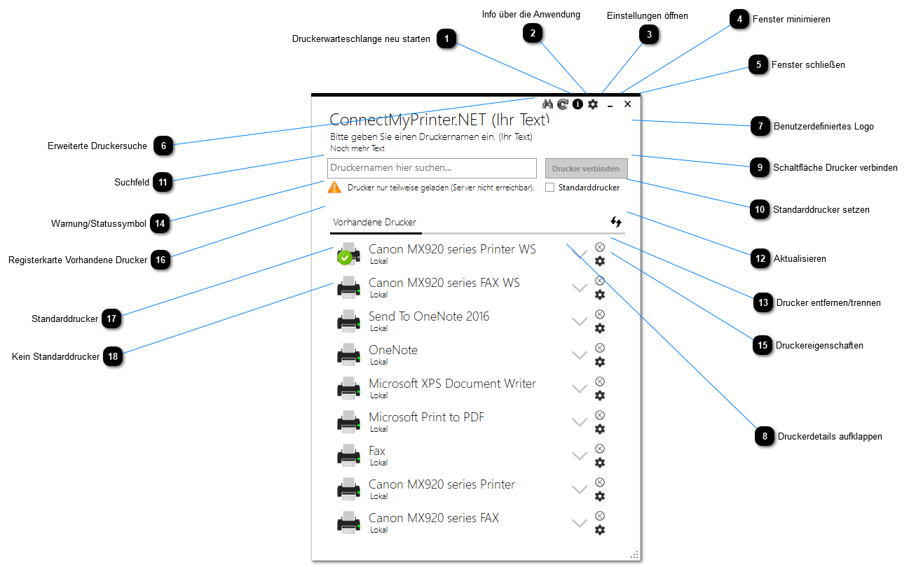
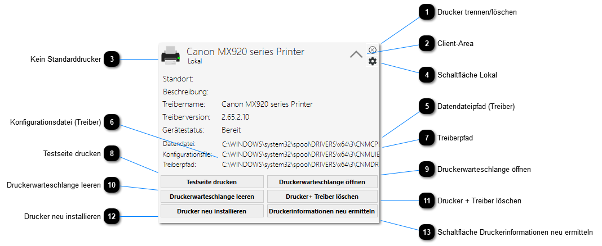
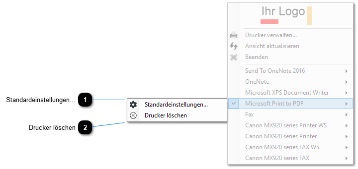
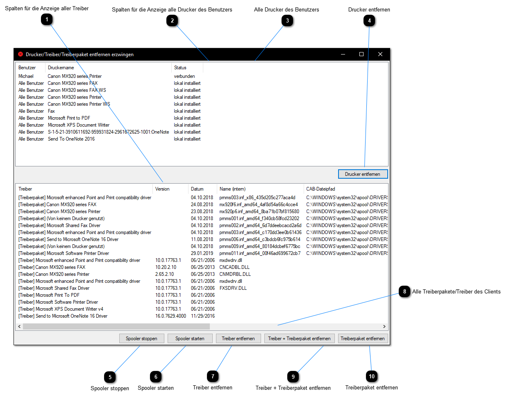

<h1>ConnectMyPrinter.NET</h1>



**Wenn Netzwerkdrucker im Unternehmensnetzwerk eingesetzt werden, werden diese in der Regel über einen zentralen Printserver mit dem Client verbunden. 
Leider kommt es in vielen Umgebungen vor, dass es nicht nur einen Printserver gibt. Das führt oft zu Verwirrungen bei den Endanwendern.
Wenn hierzu dann die Netzwerkerkennung unter Windows über Gruppenrichtlinien deaktiviert sind und der Benutzer natürlich keine Administrator-Rechte besitzt, 
ist dieser relativ aufgeschmissen. Somit kann der Drucker auch mit der Eingabe der IP-Adresse nicht wie gewohnt unter "Geräte und Drucker" installiert werden.**

In diesem Fall müssen die Benutzer den Drucker mit Eingabe des UNC-Pfades unter "Start" verbinden oder auf dem Printserver direkt nach dem Drucker suchen. Doch was ist, wenn die Endanwender den Namen des Printservers nicht wissen?

In der Regel würde hier ein Anruf bei der IT, bzw. des Service Desks erfolgen. Mit diesem kleinen Programm können allerdings einige Stolperfallen verhindert werden:

Es sind beliebig viele Windows-Printserver definierbar, welche nach freigegebenen Druckern durchsucht werden und dem Anwender bei der Suche nach einem Freigabenamen direkt vorgeschlagen werden
Zusätzlich ist es möglich, bei jedem Printserver Prioritäten festzulegen. Ist z.B. ein Drucker auf 2 Printservern angelegt, wird der höher eingestufte Printserver verwendet. Optional kann die Anwendung auch nach dem gewünschten Printserver fragen.
Der Anwender wird nicht mehr mit Printservernamen konfrontiert, sondern muss nur noch den Freigabenamen wissen
Über die Anwendung werden optional auch alle lokalen Drucker sowie Netzwerkdrucker angezeigt, welche mit ein paar Klicks auch gelöscht werden können
Druckereinstellungen können einfacher geändert werden
Der Standarddrucker kann mit 2 Klicks angepasst werden und wird dem Anwender direkt auf den ersten Blick ersichtlich
Optional kann ein Drucker auch in einem Profil gespeichert und später wieder verbunden werden
Für Support-Admins werden wichtige Informationen (Treiberversion, Treiberpfad) direkt beim Aufklappen eines Eintrags angezeigt:



Ein Drucker kann mit wenigen Klicks neu installiert (der Drucker, Treiber sowie das Treiberpaket wird hierbei entfernt) oder die Standardeinstellungen des Drucker zurückgesetzt werden.
Dokumente, welche in der Druckerwarteschlange hängen, können einfach gelöscht werden
Wenn Abhängigkeiten zwischen den Druckern bestehen, da diese den gleichen Treiber verwenden, gibt es die Möglichkeit beide (bzw. alle abhängigen Drucker) zu löschen und erneut zu installieren.
Vollständige Unterstützung der UAC: Wird ein administrativer Eingriff notwendig, wird für diesen explizit ein Prozess generiert
Optionale Änderung der Berechtigung für den Windows-Spoolerdienst: Mit einer kleinen Anwendung werden die Berechtigungen so gesetzt, dass auch ein Benutzer mit eingeschränkten Berechtigungen die Druckerwarteschlange selbst neu starten kann.
Optionaler Minimal-Mode: Es können nur Drucker verbunden werden. Optional kann festgelegt werden, ob der Endanwender die Anwendung auch im normalen Modus erweitern darf

Einfaches Customizing: Es kann ein eigenes Unternehmenslogo festgelegt, sowie einige Texte in der Anwendung angepasst werden.
Einige Anzeigetexte können für die Anpassung an Firmenanforderungen geändert oder Limitierungen für Anwender eingestellt werden.

Trayanwendung, welche alle installierten Drucker anzeigt und der aktuelle Standarddrucker geändert werden kann:
Bei jedem Drucker kann auch in die Standardeinstellungen gesprungen, sowie der Drucker gelöscht bzw. getrennt werden:



Profileditor für die Erstellung von "Druckerprofilen"
Mit einem kleinen Tool können Druckerprofile erstellt werden, welche automatisch z.B. 2 Drucker verbinden, den Standarddrucker ändern sowie einen Drucker löschen. Hierzu wird eine Profildatei mit der Dateierweiterung *.prpr erstellt. Die Profildatei ist in einer XML-Struktur aufgebaut, kann also jederzeit auch ohne den Profileditor bearbeitet werden.
Es ist möglich, Druckerprofile über eine UNC-Freigabe auf einen anderen Client zu "pushen", die aktuell verbundenen Drucker abzurufen oder eine Konfiguration von einem Client auf einen anderen Client zu klonen.
Falls ein Drucker bzw. Treiber sich nicht mit "normalen" Mitteln aus der Druckerwarteschlange entfernen lässt, stehen dem Administrator weitere Funktionen zur Verfügung:
Drucker entfernen erzwingen

Wenn sich ein Drucker nicht mehr mit Windows-Bordmitteln entfernen lässt:
Diese Anwendung entfernt die Drucker sowie Treiber Low-Level direkt in der Windows Registry:



Falls die Anwendung auf einem englischsprachigen Windows (en-US) ausgeführt wird, ist die Oberfläche lokalisiert.

<h2>Verteilung</h2>

Um die Anwendung unbeaufsichtigt zu installieren, kann der folgende Aufruf verwendet werden:
```ConnectMyPrinter.NET.msi /q /norestart APPSETTINGSFILE=AppSettings.xml LOGOFILE=logo.gif```

Für eine unbeaufsichtigte Deinstallation folgender Aufruf:
```msiexec /x {D9F305BE-DA52-4B9B-BCD9-9CF4C34BBE07} /q /norestart```